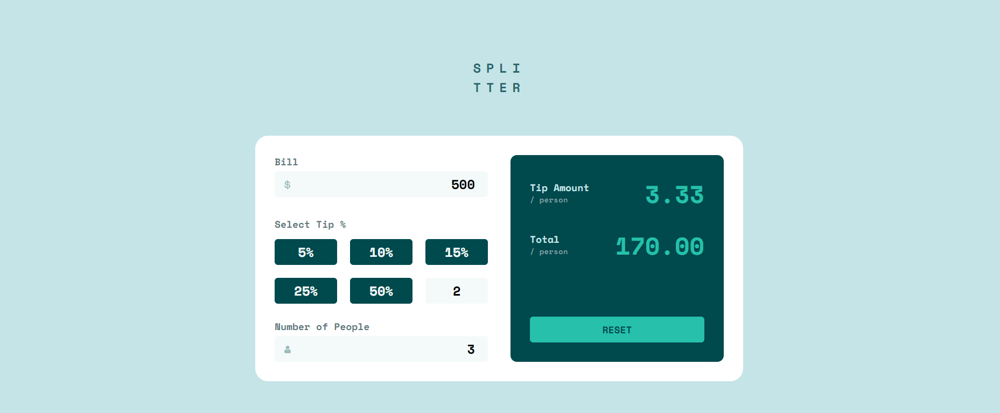

# Frontend Mentor - Tip calculator app solution

This is a solution to the [Tip calculator app challenge on Frontend Mentor](https://www.frontendmentor.io/challenges/tip-calculator-app-ugJNGbJUX). Frontend Mentor challenges help you improve your coding skills by building realistic projects.

## Table of contents

- [Overview](#overview)
  - [The challenge](#the-challenge)
  - [Screenshots](#screenshots)
  - [Links](#links)
- [Built with](#built-with)
- [Author](#author)

## Overview

### The challenge

Users should be able to:

- View the optimal layout for the app depending on their device's screen size
- See hover states for all interactive elements on the page
- Calculate the correct tip and total cost of the bill per person

### Screenshots

#### Mobile

#### Desktop

### Links

- Live Site URL: [Splitter](https://splitter-eight.vercel.app/)

## Built with

### Technologies

- [Next.js](https://nextjs.org/) - React Framework
- [TailwindCSS](https://tailwindcss.com/) - CSS Framework
- [VSCode](https://code.visualstudio.com/) - Code Editor

## Author

- Name - Pratik Bhangire (pratikbhangire@gmail.com)
- Frontend Mentor - [@pratikbhangire123](https://www.frontendmentor.io/profile/pratikbhangire123)
- Twitter - [@PratikBhangire](https://www.twitter.com/PratikBhangire)
